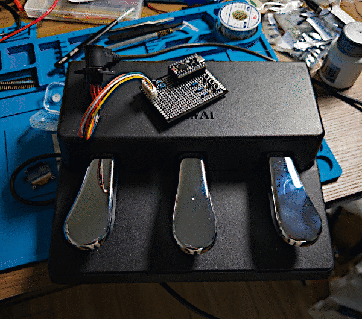
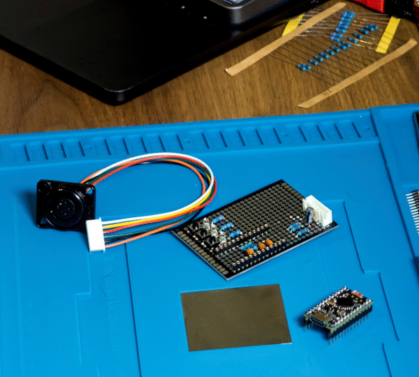
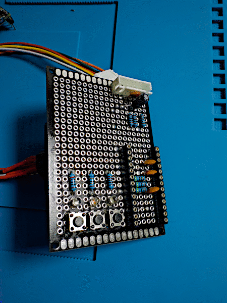
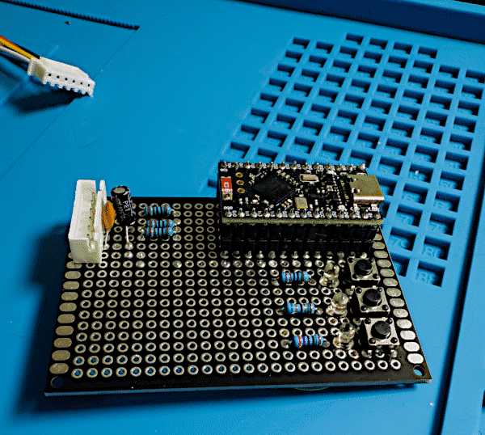

# MIDAL MIDI Interface

Firmware for the **MIDAL** piano pedal interface built around the
ProMicro nRF52840. The device samples three optical pedals (damper,
sostenuto, soft) at high resolution and transmits MIDI CC messages simultaneously via USB MIDI, Bluetooth MIDI, and DIN5 MIDI.



## Features

- **Triple simultaneous MIDI output**: USB MIDI, Bluetooth MIDI, and DIN5 MIDI
- **Three-channel pedal sampling**: High-resolution optical sensors (damper, sostenuto, soft) using SAADC
- **Advanced filtering system**: Automatic alpha calculation with asymmetric filtering for musical response
  - Fast attack for quick pedal press detection
  - Slow release for smooth pedal lift behavior
- **USB CDC logging**: Debug output via USB Serial using Zephyr's logging system
- **USB MIDI2**: Implementation via Zephyr's USB `device-next` stack (USBD)
- **Bluetooth MIDI**: Implementation via the `zephyr-ble-midi` module
- **Status LEDs** (planned):
  - Power LED: On when awake, blinks when data wiped
  - BLE LED: On when connected/idle, blinks when active
  - USB LED: On when connected/idle, blinks when active
- **Control buttons** (planned):
  - Power: Wake up on short press
  - BLE: Disconnect (short) / Forget pairings (long)
  - USB: Toggle auto-off (short) / Clear calibration (long)
- **BLE configuration and firmware update** (planned):
  - Over-the-air configuration support via Bluetooth
  - Firmware update via Bluetooth
- **Modular architecture**: Clean separation between pedal sampling, MIDI routing, and transport layers

## Hardware Summary

The hardware is described in detail in the [hardware README](hardware/README.md).

- Base board: ProMicro nRF52840.
- Pedal inputs:
  - Damper – P0.31 / NRF_SAADC_AIN7
  - Sostenuto – P0.02 / NRF_SAADC_AIN0
  - Soft – P0.29 / NRF_SAADC_AIN5
- Optical pedal module (e.g. Kawai GFP-3) powered at 3V3 with 1 kΩ series
  resistors and 4.7 kΩ shunt for biasing (RC filter removed for more consistent measurements).
- Status LEDs (not implemented yet)
  - `LED_POWER`: on when awake, blink on data wipe
  - `LED_USB`: on when USB idle, blink on activity
  - `LED_BLE`: on when BLE idle, blink on activity
- User buttons (not implemented yet)
  - `BTN_POWER`: wake on short press
  - `BTN_BLE`: short = disconnect, long = forget pairings
  - `BTN_USB`: short = toggle auto-off, long = clear calibration





## Firmware Architecture

The firmware uses a modular architecture with clean separation of concerns:

```
Timer ISR → Semaphore → Sensor Thread → ADC reads + filtering + MIDI
                                      ↓
                               MIDI Router → Transports (USB/BLE/DIN)
```

### Core Components

**Pedal System** (Recently refactored for thread safety):

- `src/pedal/pedal.c`: Main coordination module with single `pedal_init()` public API
- `src/pedal/pedal_sampler.c`: Pure hardware interface (ADC, sensors, data processing)
- `src/pedal/pedal_sampler_thread.c`: Threading infrastructure (semaphore, thread management, timer callbacks)

**MIDI Routing**:

- `src/midi/midi_router.c`: Queue-based router with per-transport worker threads, statistics, and drop counters

**Transport Layers**:

- `src/transports/transport_usb_midi.c`: USB MIDI implementation via Zephyr's device-next stack
- `src/transports/transport_ble_midi.c`: Bluetooth MIDI transport
- `src/transports/transport_din_midi.c`: DIN5 MIDI output (planned)

**Diagnostics**:

- USB CDC Logger: Implements USB CDC logging via Zephyr's logging system
- `src/diag/heartbeat.c`: Periodic health monitoring and statistics

## Prerequisites

- **nRF Connect SDK 3.1.1** with the matching Zephyr toolchain.
- `west` (installed with the SDK) and git submodules enabled.
- Repository layout (clone this repo, then initialize submodules):

  ```bash
  git clone <your fork>
  cd midal
  git submodule update --init --recursive
  ```

## Building

1. Export the SDK environment (via nRF Connect for VS Code or CLI):

   ```bash
   source ~/ncs/v3.1.1/zephyr/zephyr-env.sh
   ```

2. Build with west:

   ```bash
   west build -b promicro_nrf52840_nrf52840_uf2
   ```

3. Flash:

   ```bash
   west flash
   ```

   or copy the generated UF2 to the bootloader drive.

## Configuration Highlights

Key options in `prj.conf`:

- `CONFIG_MIDAL_POLL_HZ`: SAADC sampling frequency (default 1000 Hz)
- `CONFIG_MIDAL_FILTER_TAU_MS`: Filter time constant in milliseconds for automatic alpha calculation
- `CONFIG_MIDAL_USE_14BIT_CC`: Emit high-resolution CC values
- Bluetooth stack tuning:
  - `CONFIG_BT_*` buffer counts sized for the SoftDevice controller
  - `CONFIG_BLE_MIDI_*` options from the `zephyr-ble-midi` module
- USB MIDI pipeline: Optional UMP output via `CONFIG_MIDAL_USB_MIDI2_NATIVE`

## Runtime Notes

- Heartbeat output logs USB/BLE readiness and router queue statistics once
  per second.
- The USB transport may log `Unable to allocate Tx net_buf` if the host pauses;
  this is normal and the driver retries automatically.
- BLE advertising restarts automatically after disconnects; the BLE transport
  schedules retries if the controller is temporarily out of buffers.
- Calibration runs continuously. When pedals are unplugged, the filters clamp
  output until valid motion is detected.

## Current Status

✅ **Completed (October 2025)**:

- Clean modular architecture ready for expansion
- Pedal system operational with proper thread context for ADC reads
- Advanced filtering with automatic tuning and musical response
- USB logs cleaned up, debugging-friendly rate-limited output
- Sensor polling at 1000Hz for production (configurable down to 1Hz for testing and up to 4000 Hz)
- All ADC context issues resolved
- Hardware updated: RC filter removed for more consistent measurements
- **MIDI Router**: Fully implemented with queue-based routing, statistics, and worker threads
- **USB MIDI**: Complete implementation via Zephyr's device-next stack
- **Bluetooth MIDI**: Complete implementation and working

📋 **Planned**:

- DIN5 MIDI output
- Status LEDs implementation
- Control buttons functionality
- Power management and sleep/wake
- Pedal calibration features
- BLE configuration support
- BLE OTA firmware update
- Migration to Zephyr Zbus for event bus decoupling

## Directory Overview

- `src/`
  - `pedal/`: sampling, filtering, calibration (recently refactored)
  - `midi/`: router, codec and event types (fully implemented)
  - `transports/`: USB and BLE transports (both working)
  - `diag/`: heartbeat and self-test utilities
- `modules/lib/zephyr-ble-midi`: external BLE MIDI service module (git
  submodule)

## Troubleshooting

- **ADC conversion timeouts**: occasional warnings can appear during heavy
  BLE/USB traffic; the reader aborts and retries automatically. Persistent
  timeouts usually indicate wiring or power issues.

## Contributing / Next Ideas

- **Zephyr Zbus Migration**: Migrate the MIDI event bus from direct function calls to Zephyr Zbus for better decoupling and scalability
- **Pedal Presence Detection**: Add automatic detection so unplugged pedals are muted automatically
- **User Interface**: Implement LED indication and button-based control for device management
- **BLE Configuration**: Add over-the-air configuration support via Bluetooth
- **BLE OTA Firmware Update**: Add over-the-air firmware update support via Bluetooth
- **Visual Configuration**: Add display support for local configuration and status
- **Advanced Calibration**: Implement user-controllable pedal calibration features

Pull requests are welcome! Please run `west build` for the promicro board and
ensure coding style follows the surrounding modules.
